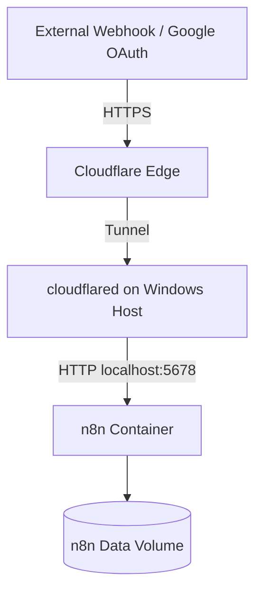

# ☁️ Cloudflare Tunnel + n8n

> **Securely expose a local n8n instance to the internet without opening router ports.**
>
> This guide covers **Cloudflare Quick Tunnels for development** and **Named Tunnels for production**, including Docker, webhooks, and Google OAuth 2.0.


---

## 📑 Table of Contents

- [🏗️ Architecture](#️-architecture)
- [✅ Prerequisites](#-prerequisites)
- [🚀 Quick Tunnel](#-quick-tunnel)
- [🐳 n8n Docker Configuration](#-n8n-docker-configuration)
- [🔐 Google OAuth 2.0](#-google-oauth-20)
- [🌐 Production Named Tunnel](#-production-named-tunnel)
- [🧪 Verification](#-verification)
- [🛠️ Troubleshooting](#️-troubleshooting)
- [🔄 Development to Production](#-development-to-production)
- [🔒 Security Notes](#-security-notes)

---

## 🏗️ Architecture



### Request flow

| Layer | Component | Purpose |
|---|---|---|
| 🌍 1 | External service | Sends webhook or OAuth request |
| ☁️ 2 | Cloudflare Edge | Receives HTTPS traffic |
| 🔐 3 | Cloudflare Tunnel | Creates an outbound tunnel to your host |
| 🖥️ 4 | `cloudflared` | Forwards traffic to local n8n |
| ⚙️ 5 | n8n | Receives the request on port `5678` |

> **Key benefit:** No router port forwarding is required, and your public IP does not need to be exposed to receive the traffic.

---

## ✅ Prerequisites

Before starting, make sure you have:

- **Windows 11**
- **WSL 2 / Docker Desktop**
- **n8n** running on port `5678`
- **Cloudflare account**
- **`cloudflared`** installed on the Windows host
- A **custom domain** for production

Verify n8n locally first:

```text
http://localhost:5678
```

Verify `cloudflared`:

```powershell
cloudflared --version
```

---

# 🚀 Quick Tunnel

Quick Tunnels are intended for **development and testing**. They generate a temporary hostname ending in `.trycloudflare.com`.

## 1. Start the Quick Tunnel

Open **PowerShell**:

```powershell
cloudflared tunnel --protocol http2 --url http://localhost:5678
```

### Example output

```text
+--------------------------------------------------------------------------------------------+
|  Your quick Tunnel has been created! Visit it at:                                         |
|  https://customise-dow-surprising-meet.trycloudflare.com                                   |
+--------------------------------------------------------------------------------------------+
```

Your hostname will be different.

> [!IMPORTANT]
> A Quick Tunnel hostname is temporary. When the tunnel is recreated, the hostname can change.

---

# 🐳 n8n Docker Configuration

n8n must know its public HTTPS URL so that it can generate the correct webhook and OAuth URLs.

## 2. Stop the existing n8n container

```powershell
docker stop n8n
docker rm n8n
```

## 3. Start n8n with the public Cloudflare URL

Replace the example hostname with your current Quick Tunnel URL:

```powershell
docker run -d `
  --name n8n `
  --restart unless-stopped `
  -p 5678:5678 `
  -e WEBHOOK_URL=https://customise-dow-surprising-meet.trycloudflare.com/ `
  -e N8N_RESTRICT_FILE_ACCESS_TO=/files/ `
  -v n8n_data:/home/node/.n8n `
  -v C:\n8n:/files `
  n8nio/n8n
```

### Configuration summary

| Setting | Value | Purpose |
|---|---|---|
| Container | `n8n` | Container name |
| Host port | `5678` | Local n8n access |
| `WEBHOOK_URL` | Public HTTPS URL | Webhook/OAuth URL generation |
| `N8N_RESTRICT_FILE_ACCESS_TO` | `/files/` | Restricts file access |
| `n8n_data` | Docker volume | Persistent n8n data |
| `C:\n8n:/files` | Bind mount | Exposes selected host files |

## 4. Confirm the container is running

```powershell
docker ps
```

You should see `n8n` with port `5678` published.

You can also check logs:

```powershell
docker logs -f n8n
```

---

# 🔐 Google OAuth 2.0

When n8n moves from `localhost` to HTTPS through Cloudflare, Google must be configured with the **exact same redirect URI**.

## 5. Configure Google Cloud

Open:

**Google Cloud Console → APIs & Services → Credentials**

Edit the relevant **OAuth 2.0 Client ID** and add this under **Authorized redirect URIs**:

```text
https://customise-dow-surprising-meet.trycloudflare.com/rest/oauth2-credential/callback
```

> [!WARNING]
> The hostname must match the n8n public URL exactly. A mismatch can cause `redirect_uri_mismatch`.

## 6. Verify the n8n OAuth URL

In n8n:

**Settings → Credentials → Gmail OAuth2 API**

Confirm the OAuth Redirect URL is:

```text
https://customise-dow-surprising-meet.trycloudflare.com/rest/oauth2-credential/callback
```

Then:

1. Select **Reconnect** or **Switch account**.
2. Sign in with Google.
3. Grant the required permissions.
4. Return to n8n and verify the credential is connected.

---

# 🌐 Production Named Tunnel

For production, use a **Named Tunnel** with a stable custom domain instead of a Quick Tunnel.

## 7. Create the tunnel

In the **Cloudflare Zero Trust dashboard**:

**Networks → Tunnels → Create a Tunnel**

Example tunnel name:

```text
n8n-tunnel
```

## 8. Install the Windows service

Cloudflare provides a tunnel token for the connector. Install it as a service:

```powershell
cloudflared.exe service install <TOKEN>
```

> [!CAUTION]
> Never publish `<TOKEN>` or a real tunnel token in GitHub, screenshots, documentation, or `.env` files committed to a repository.

## 9. Add the public hostname

Create a **Published Application** route:

| Field | Value |
|---|---|
| Subdomain | `n8n` |
| Domain | `yourdomain.com` |
| Service | `http://localhost:5678` |

Your production URL becomes:

```text
https://n8n.yourdomain.com
```

---

# 🐳 Production n8n Configuration

Update `WEBHOOK_URL` to the permanent hostname.

### `docker-compose.yml`

```yaml
environment:
  - WEBHOOK_URL=https://n8n.yourdomain.com/
```

### Docker Run example

```powershell
docker run -d `
  --name n8n `
  --restart unless-stopped `
  -p 5678:5678 `
  -e WEBHOOK_URL=https://n8n.yourdomain.com/ `
  -e N8N_RESTRICT_FILE_ACCESS_TO=/files/ `
  -v n8n_data:/home/node/.n8n `
  -v C:\n8n:/files `
  n8nio/n8n
```

After the production hostname is active, update the Google OAuth redirect URI as well:

```text
https://n8n.yourdomain.com/rest/oauth2-credential/callback
```

---

# 🧪 Verification

Run through these checks after configuration.

## Cloudflare

- [ ] `cloudflared` is running
- [ ] Tunnel status is healthy
- [ ] Public hostname is configured
- [ ] HTTPS hostname opens successfully
- [ ] Hostname points to `http://localhost:5678`

## Docker / n8n

- [ ] `n8n` container is running
- [ ] Port `5678` is published
- [ ] `WEBHOOK_URL` matches the public HTTPS URL
- [ ] `n8n_data` volume is present
- [ ] `http://localhost:5678` works locally

## OAuth

- [ ] Google OAuth client has the correct callback URI
- [ ] n8n shows the same callback URI
- [ ] OAuth reconnect succeeds
- [ ] Google authorization completes successfully

## Webhooks

- [ ] Workflow is active
- [ ] External service can reach the public URL
- [ ] Test webhook is received
- [ ] Workflow execution appears in n8n

---

# 🛠️ Troubleshooting

| Problem | Likely cause | Fix |
|---|---|---|
| Console appears stuck or incomplete | QUIC/UDP behavior | Retry with `--protocol http2` |
| `redirect_uri_mismatch` | Google URI differs from n8n URI | Match the exact HTTPS callback URL |
| Cloudflare shows `0 Routes` | No public hostname is configured | Add a Published Application route |
| Webhook still uses `localhost` | `WEBHOOK_URL` is missing/stale | Update `WEBHOOK_URL` and recreate/restart n8n |
| Quick Tunnel URL stops working | Temporary tunnel ended | Restart `cloudflared` and update URLs |
| OAuth works locally but not through Cloudflare | Google only has localhost configured | Add the Cloudflare callback URI |
| Cloudflare opens but n8n does not respond | n8n/container/port issue | Check `docker ps`, logs, and port `5678` |

### Useful diagnostic commands

Check n8n:

```powershell
docker ps
docker logs --tail 100 n8n
```

Check local access:

```powershell
curl http://localhost:5678
```

Check the installed Cloudflare CLI:

```powershell
cloudflared --version
```

---

# 🔄 Development to Production

## Development

```text
n8n localhost:5678
        │
        ▼
Quick Tunnel
        │
        ▼
*.trycloudflare.com
        │
        ▼
Testing Webhooks + OAuth
```

## Production

```text
n8n localhost:5678
        │
        ▼
Named Cloudflare Tunnel
        │
        ▼
n8n.yourdomain.com
        │
        ▼
Production Webhooks + OAuth
```

### Recommended migration sequence

1. Run n8n locally on port `5678`.
2. Test with a Quick Tunnel.
3. Set `WEBHOOK_URL` to the temporary HTTPS URL.
4. Configure and test the Google OAuth redirect URI.
5. Create the Named Tunnel.
6. Attach your custom domain/subdomain.
7. Point the hostname to `http://localhost:5678`.
8. Change `WEBHOOK_URL` to the permanent URL.
9. Update Google OAuth to the permanent callback URL.
10. Test webhooks and OAuth again.

---

# 🔒 Security Notes

> [!IMPORTANT]
> Cloudflare Tunnel removes the need for inbound router port forwarding, but it does **not** replace application security.

### Recommended practices

- Keep the n8n editor protected with strong authentication.
- Never commit Cloudflare tunnel tokens or API credentials.
- Never commit OAuth client secrets.
- Keep secrets in environment variables or another secure secret store.
- Use a stable Named Tunnel for production.
- Restrict file access to the intended directory.
- Keep Docker and n8n updated.
- Review Cloudflare Access policies for sensitive deployments.

---

## ✅ Final Production Checklist

| Area | Status |
|---|---|
| Cloudflare Named Tunnel | ⬜ |
| Stable DNS hostname | ⬜ |
| `cloudflared` Windows service | ⬜ |
| n8n on `localhost:5678` | ⬜ |
| `WEBHOOK_URL` configured | ⬜ |
| Google OAuth redirect URI | ⬜ |
| Webhook test successful | ⬜ |
| OAuth test successful | ⬜ |
| Secrets excluded from Git | ⬜ |
| n8n authentication enabled | ⬜ |

---

## 📌 Important URLs

| Purpose | URL |
|---|---|
| Local n8n | `http://localhost:5678` |
| Quick Tunnel | `https://<temporary>.trycloudflare.com` |
| Production n8n | `https://n8n.yourdomain.com` |
| OAuth callback | `https://n8n.yourdomain.com/rest/oauth2-credential/callback` |

---

<div align="center">

**Cloudflare Tunnel + n8n**  
*Secure public access for local automation workflows*

</div>
